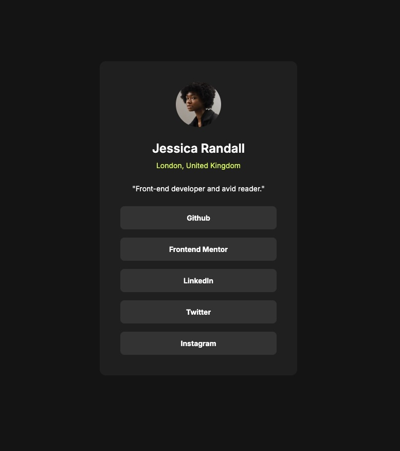

# Frontend Mentor - Social links profile solution

This is a solution to the [Social links profile challenge on Frontend Mentor](https://www.frontendmentor.io/challenges/social-links-profile-UG32l9m6dQ). Frontend Mentor challenges help you improve your coding skills by building realistic projects.

## Table of contents

- [Overview](#overview)
  - [The challenge](#the-challenge)
  - [Screenshot](#screenshot)
  - [Links](#links)
- [My process](#my-process)
  - [Built with](#built-with)
  - [What I learned](#what-i-learned)
  - [Useful resources](#useful-resources)
- [Author](#author)

**Note: Delete this note and update the table of contents based on what sections you keep.**

## Overview

### The challenge

Users should be able to:

- See hover and focus states for all interactive elements on the page

### Screenshot



### Links

- Solution URL: [Solution](https://github.com/vince4dev/challenge3)
- Live Site URL: [Live site](https://vince4dev.github.io/challenge3/)

## My process

### Built with

- Semantic HTML5 markup
- CSS custom properties
- Flexbox
- CSS Grid

### What I learned

This project involved creating a web page simulating a map containing social media links. The objective was to put into practice the knowledge acquired in web development, particularly concerning the use of Flexbox, Grid and other CSS properties.

## Points learned:

### Using Grid CSS

- For the arrangement of elements on the page, I chose to use Grid CSS technology. This technique allows for flexible and responsive arrangement of elements, which is essential to ensure that the page is readable on different devices.

```css
.card__link {
  display: grid;
  gap: 1rem;
}
```

### Using Transition, hover (:hover) and focus (:focus)

- To bring the links (<li> <a>) to life, I used the transition,:hover and :focus-visible properties. These three techniques allow you to create animations and visual effects that improve the user experience.

```css
.card__link li > a {
  ...
  transition: 300ms ease-in-out;
}

.card__link li > a:hover,
.card__link li > a:focus-visible {
  background-color: var(--clr-green);
  color: var(--clr-grey-700);
}
```

### Useful resources

- [google-webfonts-helper](https://gwfh.mranftl.com/fonts) - This helped me find the font and integrate it into the project.
- [MDN](https://developer.mozilla.org/fr/) - Resources for Developers.

## Author

- Frontend Mentor - [@vince4dev](https://www.frontendmentor.io/profile/vince4dev)
